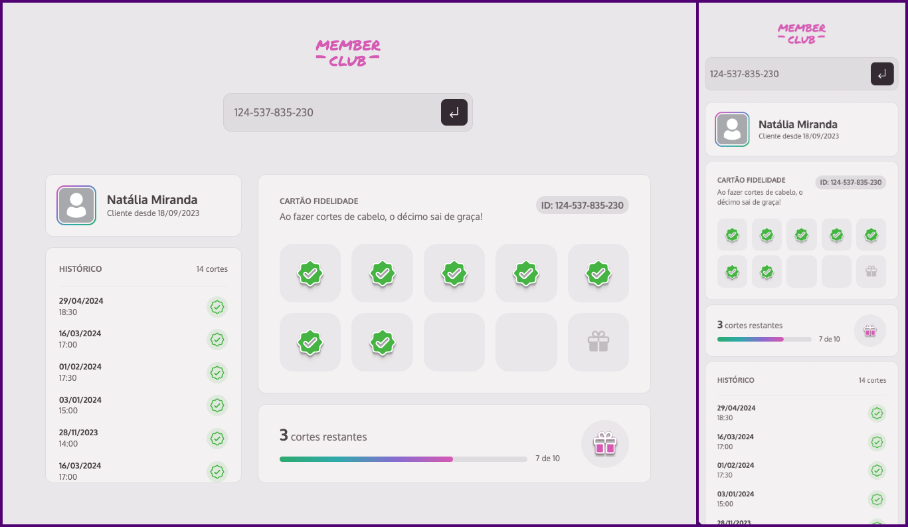

# Member's club
Projeto de um sistema de cartão de fidelidade construído com HTML/CSS e Javascript

  

## Sobre

Focado apenas em HTML/CSS e Javascript, o projeto visa as coisas fantastiscas que podem ser feitas sem o auxilio de frameworks e libs externas para o layout hmtl.
Neste projeto testei meus conhecimentos em front end. O back-end foi representado pela lib json-server, que cria um server para receber as request com base em uma estrutura json.

## 🚀 Tecnologias

Esse projeto foi desenvolvido com as seguintes tecnologias:

- HTML
- CSS
- JAVASCRIPT